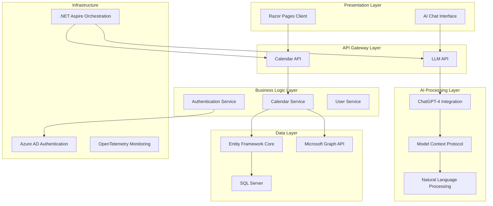
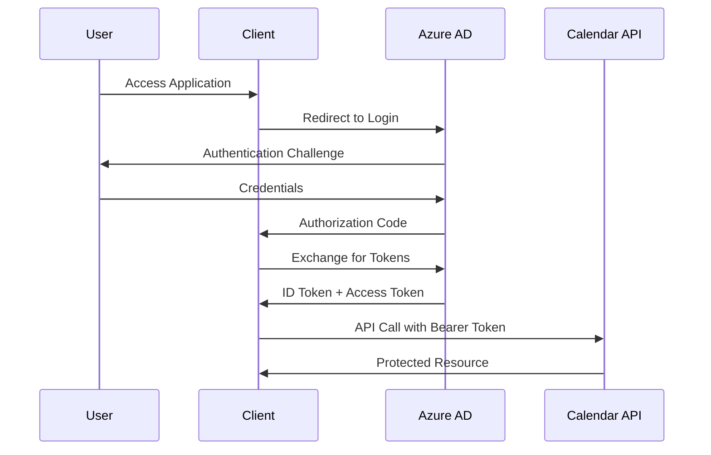
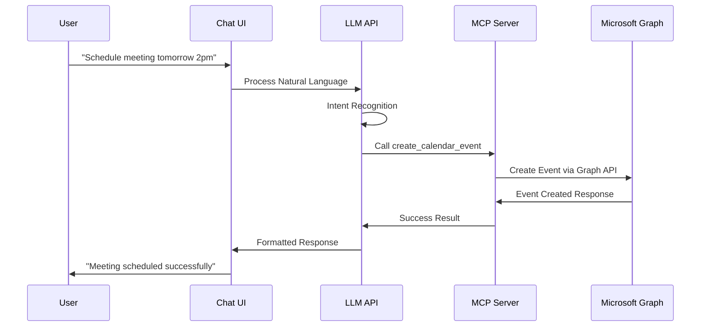
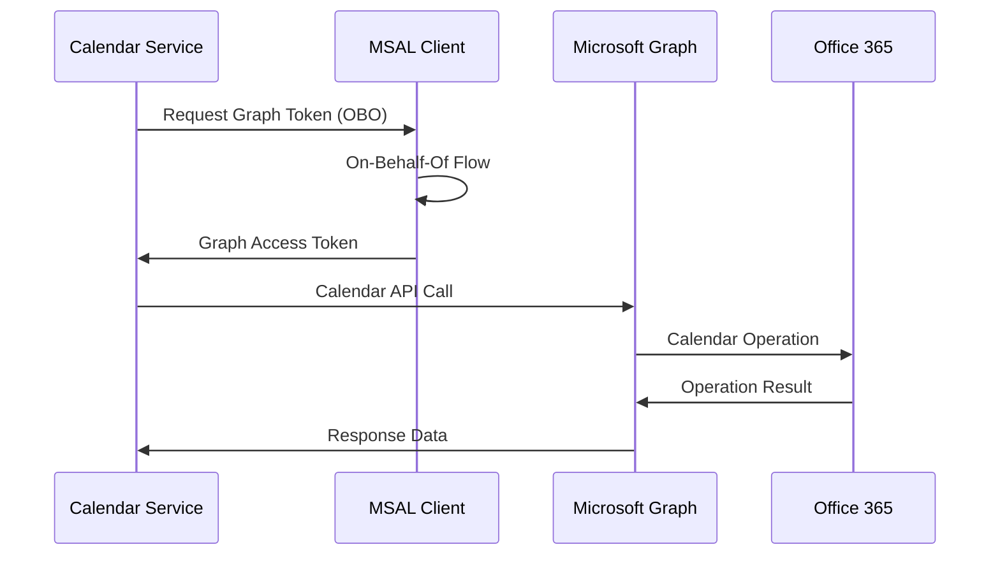

# AI Calendar - Enterprise-Grade AI-Powered Calendar Management System

[](https://dotnet.microsoft.com/download/dotnet/8.0)
[](https://docs.microsoft.com/aspnet/core)
[](https://docs.microsoft.com/graph)
[](https://openai.com)
[](https://docs.microsoft.com/dotnet/aspire)
[](https://azure.microsoft.com/services/active-directory)

## ?? Project Overview

AI Calendar is a sophisticated, enterprise-grade calendar management system that seamlessly integrates artificial intelligence with Microsoft Graph API to provide intelligent calendar operations through natural language processing. The application demonstrates advanced software architecture patterns, modern cloud technologies, and AI-driven user experiences.

### ?? Key Objectives

- **AI-Powered Calendar Management**: Natural language processing for calendar operations
- **Enterprise Security**: Azure AD integration with JWT authentication and OAuth 2.0
- **Microservices Architecture**: Modular, scalable design with clear separation of concerns
- **Modern Development Stack**: Cutting-edge .NET 8 features and cloud-native patterns
- **Real-time Communication**: Advanced AI chat interface with contextual understanding
- **Microsoft Graph Integration**: Full calendar synchronization with Office 365/Outlook

## ??? Architecture Overview

The application follows a sophisticated **microservices architecture** with **Domain-Driven Design (DDD)** principles, implementing enterprise patterns such as **Repository Pattern**, **Dependency Injection**, and **Clean Architecture**.



## ??? Technology Stack

### **Core Technologies**
- **.NET 8** - Latest LTS framework with enhanced performance and features
- **ASP.NET Core 8** - High-performance web framework
- **Entity Framework Core 9** - Advanced ORM with SQL Server integration
- **Razor Pages** - Server-side rendered UI with modern web patterns

### **AI & Machine Learning**
- **OpenAI GPT-4** - Advanced natural language processing via GitHub Models
- **Microsoft Extensions AI** - Unified AI abstractions for .NET
- **Model Context Protocol (MCP)** - Advanced AI tool orchestration
- **Semantic Kernel Integration** - AI workflow management

### **Authentication & Security**
- **Azure Active Directory** - Enterprise identity management
- **Microsoft Identity Web** - Seamless Azure AD integration
- **JWT Bearer Authentication** - Stateless token-based security
- **OAuth 2.0 / OpenID Connect** - Industry-standard authentication flows
- **On-Behalf-Of (OBO) Flow** - Secure token delegation for Microsoft Graph

### **Cloud & Infrastructure**
- **.NET Aspire** - Cloud-native application orchestration
- **Microsoft Graph API** - Office 365 calendar integration
- **OpenTelemetry** - Comprehensive observability and monitoring
- **SQL Server** - Enterprise-grade database with EF Core
- **Service Discovery** - Dynamic service resolution

### **Development Patterns**
- **Clean Architecture** - Layered, maintainable code structure
- **Repository Pattern** - Data access abstraction
- **Dependency Injection** - IoC container for loose coupling
- **CQRS Principles** - Command and query separation
- **Domain-Driven Design** - Business logic encapsulation

## ?? Solution Structure

```
AICalendar/
??? ?? AICalendar.Api/              # REST API Layer
?   ??? Controllers/                # API Controllers
?   ??? Program.cs                 # API Configuration
?   ??? appsettings.json           # API Settings
?
??? ?? AICalendar.Client/           # Razor Pages UI
?   ??? Pages/                     # Razor Pages
?   ??? Controllers/               # MVC Controllers
?   ??? wwwroot/                   # Static Assets
?   ??? Program.cs                 # Client Configuration
?
??? ?? AICalendar.LLMApi/          # AI Processing Service
?   ??? Controllers/               # AI Chat Controllers
?   ??? Services/                  # AI Logic Implementation
?   ??? Models/                    # AI-specific DTOs
?   ??? Program.cs                 # AI Service Configuration
?
??? ?? AICalendar.MCP/             # Model Context Protocol Server
?   ??? Services/                  # MCP Tool Implementations
?   ??? Program.cs                 # MCP Server Setup
?   ??? Tools/                     # AI-callable Functions
?
??? ?? AICalendar.Service/         # Business Logic Layer
?   ??? Implementations/           # Service Implementations
?   ??? Contracts/                 # Service Interfaces
?   ??? DTOs/                      # Data Transfer Objects
?
??? ?? AICalendar.DomainModels/    # Domain Entity Layer
?   ??? Models/                    # Entity Models
?   ??? Context/                   # EF DbContext
?   ??? DTOs/                      # Domain DTOs
?
??? ?? AICalendar.Repository/      # Data Access Layer
?   ??? Implementations/           # Repository Implementations
?   ??? Contracts/                 # Repository Interfaces
?
??? ?? AICalendar.ServiceDefaults/ # Shared Infrastructure
?   ??? Extensions.cs              # Service Configuration
?   ??? Common Configurations     # Shared Settings
?
??? ?? AICalendar.AppHost/         # Aspire Orchestration
    ??? Program.cs                 # Application Orchestration
```

## ?? Key Features & Capabilities

### **?? AI-Powered Natural Language Processing**
- **Intelligent Intent Recognition**: Advanced NLP for understanding calendar requests
- **Contextual Understanding**: GPT-4 powered conversation with memory
- **Multi-turn Conversations**: Stateful chat sessions with context retention
- **Semantic Parsing**: Extract dates, times, attendees from natural language

### **?? Advanced Calendar Management**
- **Microsoft Graph Integration**: Full synchronization with Office 365/Outlook
- **Smart Event Creation**: AI-assisted event scheduling with conflict detection
- **Attendee Management**: Intelligent invitation handling and response tracking
- **Recurring Events**: Complex recurrence pattern support
- **Time Zone Handling**: Global time zone awareness and conversion

### **?? Enterprise-Grade Security**
- **Azure AD Integration**: Seamless organizational authentication
- **Multi-Factor Authentication**: Enhanced security with MFA support
- **Role-Based Access Control**: Granular permission management
- **Secure Token Management**: JWT with refresh token rotation
- **HTTPS Everywhere**: End-to-end encryption

### **? Performance & Scalability**
- **Microservices Architecture**: Horizontal scaling capability
- **Async/Await Patterns**: Non-blocking I/O operations
- **Connection Pooling**: Optimized database connections
- **Caching Strategies**: In-memory and distributed caching
- **Load Balancing Ready**: Container orchestration support

### **?? Observability & Monitoring**
- **OpenTelemetry Integration**: Comprehensive telemetry collection
- **Distributed Tracing**: End-to-end request tracking
- **Metrics Collection**: Performance and business metrics
- **Health Checks**: Application health monitoring
- **Structured Logging**: Rich, searchable log data

## ?? Getting Started

### **Prerequisites**
- .NET 8 SDK or later
- Visual Studio 2022 (v17.8+) or VS Code with C# extension
- SQL Server (LocalDB or full instance)
- Azure AD tenant (for authentication)
- OpenAI API key or GitHub Models access

### **Configuration**

1. **Clone the Repository**
   ```bash
   git clone https://github.com/yourusername/AICalendar.git
   cd AICalendar
   ```

2. **Azure AD Setup**
   ```json
   // appsettings.json
   {
     "AzureAd": {
       "Instance": "https://login.microsoftonline.com/",
       "TenantId": "your-tenant-id",
       "ClientId": "your-client-id",
       "ClientSecret": "your-client-secret"
     }
   }
   ```

3. **AI Configuration**
   ```json
   // LLMApi appsettings.json
   {
     "GitHub": {
       "Token": "your-github-models-token"
     },
     "OpenAI": {
       "ApiKey": "your-openai-key",
       "Model": "gpt-4"
     }
   }
   ```

4. **Database Setup**
   ```bash
   dotnet ef database update --project AICalendar.Api
   ```

### **Running the Application**

**Using .NET Aspire (Recommended):**
```bash
cd AICalendar.AppHost
dotnet run
```

**Manual Service Startup:**
```bash
# Terminal 1 - API
cd AICalendar.Api
dotnet run

# Terminal 2 - LLM API
cd AICalendar.LLMApi
dotnet run

# Terminal 3 - MCP Server
cd AICalendar.MCP
dotnet run

# Terminal 4 - Client
cd AICalendar.Client
dotnet run
```

## ?? Application Flow

### **1. User Authentication Flow**


### **2. AI Chat Interaction Flow**


### **3. Microsoft Graph Integration Flow**


## ?? Core Components Deep Dive

### **Calendar Service (`AICalendar.Service`)**
- **Microsoft Graph Integration**: Direct API communication with Office 365
- **Token Management**: OAuth 2.0 On-Behalf-Of flow implementation
- **Data Transformation**: Graph API to internal DTO mapping
- **Error Handling**: Comprehensive exception management

### **AI Chat Service (`AICalendar.LLMApi`)**
- **Natural Language Processing**: GPT-4 powered intent recognition
- **Context Management**: Conversation state and memory handling
- **Tool Orchestration**: Model Context Protocol integration
- **Response Generation**: Dynamic, contextual AI responses

### **MCP Server (`AICalendar.MCP`)**
- **Tool Definition**: Calendar operation abstractions for AI
- **Parameter Extraction**: Intelligent argument parsing from natural language
- **API Integration**: Bridge between AI and calendar services
- **Schema Validation**: Type-safe tool parameter handling

### **Authentication System**
- **Azure AD Integration**: Enterprise-grade identity management
- **JWT Token Handling**: Secure, stateless authentication
- **Permission Management**: Role-based access control
- **Token Refresh**: Automatic token renewal

## ?? Performance Optimizations

### **Database Layer**
- **Entity Framework Core 9**: Latest ORM features and performance improvements
- **Connection Pooling**: Optimized database connection management
- **Async Operations**: Non-blocking database calls
- **Query Optimization**: Efficient LINQ to SQL translation

### **API Layer**
- **HTTP Client Factory**: Managed HTTP connection lifecycle
- **Response Caching**: Intelligent caching strategies
- **Compression**: Automatic response compression
- **Rate Limiting**: API throttling and protection

### **AI Processing**
- **Streaming Responses**: Real-time AI response delivery
- **Context Optimization**: Efficient prompt engineering
- **Tool Caching**: MCP tool result caching
- **Parallel Processing**: Concurrent AI operations

## ?? Monitoring & Observability

### **OpenTelemetry Integration**
- **Distributed Tracing**: End-to-end request tracking across services
- **Metrics Collection**: Application and business metrics
- **Logging**: Structured, searchable log data
- **Health Checks**: Application health monitoring

### **Performance Metrics**
- **Response Times**: API endpoint performance tracking
- **Success Rates**: Request success/failure ratios
- **Resource Usage**: Memory, CPU, and database utilization
- **AI Performance**: Token usage and response quality metrics

## ??? Security Considerations

### **Authentication & Authorization**
- **Azure AD Integration**: Enterprise identity provider
- **JWT Tokens**: Stateless, secure authentication
- **Role-Based Access**: Granular permission control
- **Multi-Factor Authentication**: Enhanced security

### **Data Protection**
- **HTTPS Everywhere**: End-to-end encryption
- **Secure Token Storage**: Protected credential management
- **Input Validation**: Comprehensive data sanitization
- **OWASP Compliance**: Security best practices implementation

### **API Security**
- **Rate Limiting**: DDoS protection and resource management
- **CORS Configuration**: Cross-origin request security
- **Authentication Middleware**: Request validation pipeline
- **Error Handling**: Secure error response patterns

## ?? Deployment & DevOps

### **.NET Aspire Orchestration**
- **Service Discovery**: Automatic service resolution
- **Configuration Management**: Centralized settings
- **Health Monitoring**: Service health checks
- **Scaling**: Horizontal scaling capabilities

### **Cloud-Native Features**
- **Container Ready**: Docker containerization support
- **Kubernetes Compatible**: K8s deployment manifests
- **Azure Integration**: Native Azure service integration
- **CI/CD Pipeline**: Automated build and deployment

## ?? Business Value & Impact

### **Productivity Gains**
- **Natural Language Interface**: Reduces calendar management complexity
- **AI-Powered Automation**: Intelligent scheduling assistance
- **Seamless Integration**: Works with existing Office 365 workflows
- **Multi-Platform Access**: Web-based accessibility

### **Technical Excellence**
- **Modern Architecture**: Demonstrates advanced .NET development skills
- **Cloud Integration**: Shows cloud-native development expertise
- **AI Implementation**: Practical AI/ML integration experience
- **Security Focus**: Enterprise-grade security implementation

### **Innovation Highlights**
- **Cutting-Edge AI**: GPT-4 integration with practical applications
- **Advanced Patterns**: Sophisticated software architecture
- **Microsoft Ecosystem**: Deep integration with Microsoft technologies
- **Scalable Design**: Enterprise-ready application architecture

## ?? Contributing

This project demonstrates advanced software development practices and modern technology integration. The codebase showcases:

- **Clean Code Principles**: SOLID principles and design patterns
- **Test-Driven Development**: Comprehensive testing strategies
- **Documentation**: Thorough code documentation and API specifications
- **Version Control**: Professional Git workflow and branching strategies

## ?? Technical Achievements

### **Architecture Patterns Implemented**
- ? **Microservices Architecture**
- ? **Domain-Driven Design (DDD)**
- ? **Repository Pattern**
- ? **Dependency Injection**
- ? **Clean Architecture**
- ? **CQRS Principles**

### **Advanced Technologies Utilized**
- ? **.NET 8 with latest features**
- ? **Azure AD Authentication**
- ? **Microsoft Graph API Integration**
- ? **OpenAI GPT-4 Integration**
- ? **Model Context Protocol (MCP)**
- ? **Entity Framework Core 9**
- ? **OpenTelemetry Observability**
- ? **.NET Aspire Orchestration**

### **Enterprise Capabilities**
- ? **Scalable Architecture**
- ? **Security Best Practices**
- ? **Performance Optimization**
- ? **Monitoring & Observability**
- ? **Cloud-Native Design**
- ? **API-First Approach**

---

## ?? Contact & Professional Profile

This project represents a comprehensive demonstration of modern software development capabilities, showcasing expertise in:

- **Enterprise Software Architecture**
- **Cloud-Native Development**
- **AI/ML Integration**
- **Microsoft Technology Stack**
- **Security Implementation**
- **Performance Optimization**

The AI Calendar application serves as a testament to professional software development skills, combining cutting-edge technologies with practical business solutions to create an enterprise-grade application that demonstrates both technical depth and innovation.

**Technologies Mastered**: .NET 8, ASP.NET Core, Azure AD, Microsoft Graph, OpenAI, Entity Framework, Microservices, Clean Architecture, and Cloud-Native Development.

---

*Built with ?? using .NET 8, Azure, and cutting-edge AI technologies*

