# AI Calendar - Enterprise-Grade AI-Powered Calendar Management System

## Project Overview

AI Calendar is a sophisticated, enterprise-grade calendar management system that seamlessly integrates artificial intelligence with Microsoft Graph API to provide intelligent calendar operations through natural language processing. The application demonstrates advanced software architecture patterns, modern cloud technologies, and AI-driven user experiences.

### Key Objectives

- **AI-Powered Calendar Management**: Natural language processing for calendar operations
- **Enterprise Security**: Azure AD integration with JWT authentication and OAuth 2.0
- **Microservices Architecture**: Modular, scalable design with clear separation of concerns
- **Modern Development Stack**: Cutting-edge .NET 8 features and cloud-native patterns
- **Real-time Communication**: Advanced AI chat interface with contextual understanding
- **Microsoft Graph Integration**: Full calendar synchronization with Office 365/Outlook

## Architecture Overview

The application follows a sophisticated **microservices architecture** with **Domain-Driven Design (DDD)** principles, implementing enterprise patterns such as **Repository Pattern**, **Dependency Injection**, and **Clean Architecture**.

```mermaid
graph TB
    %% User Interface Layer (Top)
    subgraph "🎨 Presentation Layer"
        direction LR
        A[📱 Razor Pages Client]
        B[💬 AI Chat Interface]
    end
    
    %% API Gateway Layer
    subgraph "🚪 API Gateway Layer"
        direction LR
        C[📅 Calendar API]
        D[🤖 LLM API]
    end
    
    %% AI Processing happens here in the flow
    subgraph "🧠 AI Processing Layer"
        direction LR
        E[ChatGPT-4 Integration]
        F[Model Context Protocol Server]
        G[Natural Language Processing]
    end
    
    %% Business Logic Layer
    subgraph "⚙️ Business Logic Layer"
        direction LR
        H[📅 Calendar Service]
        I[🔐 Authentication Service]
        J[👤 User Service]
    end
    
    %% Data Access Layer
    subgraph "💾 Data Layer"
        direction LR
        K[Entity Framework Core]
        L[🗄️ SQL Server]
        M[📊 Microsoft Graph API]
    end
    
    %% Infrastructure Layer (Bottom)
    subgraph "🏗️ Infrastructure Layer"
        direction LR
        N[.NET Aspire Orchestration]
        O[🔒 Azure AD Authentication]
        P[📈 OpenTelemetry Monitoring]
    end
    
    %% User Flow Connections
    A -->|HTTP Requests| C
    B -->|AI Queries| D
    
    %% API to AI Processing
    D -->|Process Queries| E
    E -->|Context & Protocol| F
    F -->|Language Analysis| G
    G -->|Structured Response| D
    
    %% API to Business Logic
    C -->|Calendar Operations| H
    D -->|Business Rules| H
    
    %% Business Logic to Data
    H -->|Data Access| K
    H -->|External Calendar Data| M
    I -->|User Authentication| O
    J -->|User Data| K
    
    %% Data Layer
    K -->|Database Operations| L
    
    %% Infrastructure Support
    N -.->|Orchestrates| C
    N -.->|Orchestrates| D
    O -.->|Provides Auth| I
    P -.->|Monitors| N
    
    %% Cross-cutting concerns
    I -.->|Auth Context| H
    I -.->|Auth Context| J
    
    %% Styling for better visual hierarchy
    classDef presentationLayer fill:#e1f5fe,stroke:#01579b,stroke-width:2px
    classDef apiLayer fill:#f3e5f5,stroke:#4a148c,stroke-width:2px
    classDef aiLayer fill:#fff3e0,stroke:#e65100,stroke-width:2px
    classDef businessLayer fill:#e8f5e8,stroke:#1b5e20,stroke-width:2px
    classDef dataLayer fill:#fce4ec,stroke:#880e4f,stroke-width:2px
    classDef infraLayer fill:#f1f8e9,stroke:#33691e,stroke-width:2px
    
    class A,B presentationLayer
    class C,D apiLayer
    class E,F,G aiLayer
    class H,I,J businessLayer
    class K,L,M dataLayer
    class N,O,P infraLayer
```

## AI Chat Interaction Flow

## Technology Stack

### **Core Technologies**
- **.NET 8** - Latest LTS framework with enhanced performance and features
- **ASP.NET Core 8** - High-performance web framework
- **Entity Framework Core 9** - Advanced ORM with SQL Server integration
- **Razor Pages** - Server-side rendered UI with modern web patterns

### **AI & Machine Learning**
- **OpenAI GPT-4** - Advanced natural language processing via GitHub Models
- **Microsoft Extensions AI** - Unified AI abstractions for .NET
- **Model Context Protocol (MCP)** - Advanced AI tool orchestration
- **Semantic Kernel Integration** - AI workflow management

### **Authentication & Security**
- **Azure Active Directory** - Enterprise identity management
- **Microsoft Identity Web** - Seamless Azure AD integration
- **JWT Bearer Authentication** - Stateless token-based security
- **OAuth 2.0 / OpenID Connect** - Industry-standard authentication flows
- **On-Behalf-Of (OBO) Flow** - Secure token delegation for Microsoft Graph

### **Cloud & Infrastructure**
- **.NET Aspire** - Cloud-native application orchestration
- **Microsoft Graph API** - Office 365 calendar integration
- **OpenTelemetry** - Comprehensive observability and monitoring
- **SQL Server** - Enterprise-grade database with EF Core
- **Service Discovery** - Dynamic service resolution

### **Development Patterns**
- **Clean Architecture** - Layered, maintainable code structure
- **Repository Pattern** - Data access abstraction
- **Dependency Injection** - IoC container for loose coupling
- **CQRS Principles** - Command and query separation
- **Domain-Driven Design** - Business logic encapsulation
 

